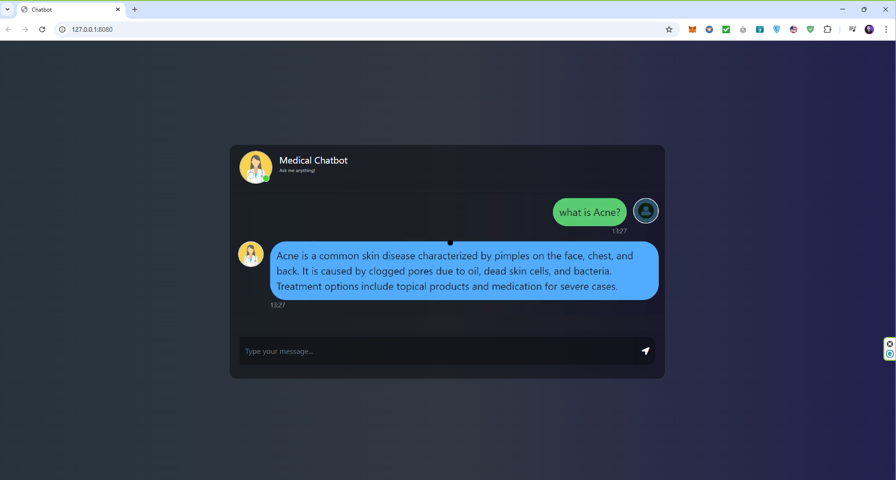

# End-To-End-Production-Ready-Medical-Chatbot-with-LLMOps
The "End-to-End Medical Chatbot Project" aims to build a sophisticated conversational AI for the healthcare domain, utilizing Large Language Models (LLMs) integrated with Pinecone and LangChain. The chatbot will provide accurate responses to health-related queries, assist in medical guidance, and retrieve relevant medical data using Pinecone's vector database for efficient and scalable search. The project involves setting up a retrieval-augmented generation (RAG) pipeline, configuring conversational flows, ensuring compliance with health information privacy standards, and validating outputs for medical accuracy. This project is ideal for creating intelligent virtual assistants for patient support, telemedicine, or healthcare research.

# Demo


# How to run?
### STEPS:

Clone the repository

```bash
Project repo: https://github.com/
```
### STEP 01- Create a conda environment after opening the repository

```bash
conda create -n medibot python=3.10 -y
```

```bash
conda activate medibot
```


### STEP 02- install the requirements
```bash
pip install -r requirements.txt
```


### Create a `.env` file in the root directory and add your Pinecone & openai credentials as follows:

```ini
PINECONE_API_KEY = "xxxxxxxxxxxxxxxxxxxxxxxxxxxxx"
OPENAI_API_KEY = "xxxxxxxxxxxxxxxxxxxxxxxxxxxxx"
```


```bash
# run the following command to store embeddings to pinecone
python store_index.py
```

```bash
# Finally run the following command
python app.py
```

Now,
```bash
open up localhost:
```


### Techstack Used:

- Python
- LangChain
- Flask
- GPT
- Pinecone


# AWS-CICD-Deployment-with-Github-Actions

## 1. Login to AWS console.

## 2. Create IAM user for deployment

	#with specific access

	1. EC2 access : It is virtual machine

	2. ECR: Elastic Container registry to save your docker image in aws


	#Description: About the deployment

	1. Build docker image of the source code

	2. Push your docker image to ECR

	3. Launch Your EC2 

	4. Pull Your image from ECR in EC2

	5. Lauch your docker image in EC2

	#Policy:

	1. AmazonEC2ContainerRegistryFullAccess

	2. AmazonEC2FullAccess

	
## 3. Create ECR repo to store/save docker image
    - Save the URI: 970547337635.dkr.ecr.ap-south-1.amazonaws.com/medicalchatbot

	
## 4. Create EC2 machine (Ubuntu) 

## 5. Open EC2 and Install docker in EC2 Machine:
	
	
	#optinal

	sudo apt-get update -y

	sudo apt-get upgrade
	
	#required

	curl -fsSL https://get.docker.com -o get-docker.sh

	sudo sh get-docker.sh

	sudo usermod -aG docker ubuntu

	newgrp docker
	
# 6. Configure EC2 as self-hosted runner:
    setting>actions>runner>new self hosted runner> choose os> then run command one by one


# 7. Setup github secrets:

   - AWS_ACCESS_KEY_ID
   - AWS_SECRET_ACCESS_KEY
   - AWS_DEFAULT_REGION
   - ECR_REPO
   - PINECONE_API_KEY
   - OPENAI_API_KEY

    

